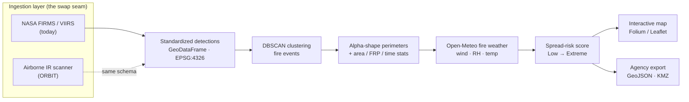

# 🔥 FirePerim Live

**A satellite-data analog of the ORBIT Data Engine.**

🟢 **Live demo:** https://fireperim-live.streamlit.app

ORBIT (EmberWorks / Coulson Aviation) ingests thermal imagery from airborne IR
scanners on firefighting aircraft, extracts fire perimeters, and publishes
georeferenced outputs to agency GIS systems (ICS, CAL FIRE, NIFC). **FirePerim
Live implements the same downstream architecture** — ingest → cluster →
perimeter → weather → risk → agency export — fed by free satellite thermal
detections (NASA VIIRS/FIRMS) instead of an airborne scanner.

> **The thesis:** *ORBIT ingests from airborne IR scanners. I built the same
> architecture using satellite thermal data. Swap the ingestion layer and you
> have ORBIT.*

The whole system is designed around that swap. Every detection source emits one
**standardized schema** (`src/fireperim/ingest/base.py`), so nothing downstream
knows or cares whether the heat came from a satellite or an aircraft.

---

## Architecture



Only the **ingestion layer** changes between FirePerim and ORBIT. Clustering,
perimeter extraction, weather fusion, risk scoring, visualization, and export
are all source-agnostic.

---

## Pipeline

| Stage | Module | Status |
|-------|--------|--------|
| 1. Ingest — VIIRS/FIRMS active fire | `ingest/firms.py` | ✅ |
| 2. Cluster detections into events (DBSCAN) | `processing/cluster.py` | ✅ |
| 3. Extract perimeters (alpha shapes) | `processing/perimeter.py` | ✅ |
| 4. Fire weather (Open-Meteo) | `weather/open_meteo.py` | ✅ |
| 5. Spread-risk score | `processing/risk.py` | ✅ |
| 6. Export GeoJSON + KMZ | `export/geojson_kmz.py` | ✅ |
| 7. Interactive map (Folium/Leaflet) | `viz/maps.py` | ✅ |

---

## The swap seam

Every source implements one abstract contract and emits one schema:

```python
class DetectionSource(ABC):
    @abstractmethod
    def fetch(self) -> gpd.GeoDataFrame: ...   # returns DETECTION_COLUMNS, EPSG:4326
```

`DETECTION_COLUMNS` = latitude, longitude, acq_datetime (UTC), frp_mw,
brightness_k, confidence, confidence_class, daynight, sensor, satellite,
scan_km, track_km (+ geometry). VIIRS and MODIS expose different raw columns;
the FIRMS client normalizes both into this schema. An airborne IR feed would do
the same — and the rest of the pipeline would not change a line.

---

## Quick start (Windows / PowerShell)

```powershell
python -m venv .venv
.\.venv\Scripts\Activate.ps1
pip install -r requirements.txt

# Free FIRMS key: https://firms.modaps.eosdis.nasa.gov/api/map_key/
Copy-Item .streamlit\secrets.toml.example .streamlit\secrets.toml
notepad .streamlit\secrets.toml     # paste FIRMS_MAP_KEY

streamlit run app.py
```

macOS / Linux: `python3 -m venv .venv && source .venv/bin/activate`, then the
same `pip`/`streamlit` steps.

No key? The app runs against a cached VIIRS sample — toggle **Use cached
sample** in the sidebar. Everything downstream behaves identically.

---

## Deploy (Streamlit Cloud)

1. Push to GitHub.
2. On [share.streamlit.io](https://share.streamlit.io), point a new app at `app.py`.
3. **App → Settings → Secrets:** `FIRMS_MAP_KEY = "your_key"`.
4. Share the public URL. Each `git push` to `main` auto-redeploys.

---

## Testing

```bash
pytest -q          # 23 tests: ingestion contract, clustering, perimeters,
                   # weather parsing, risk scoring, GeoJSON/KMZ export
```

CI (`.github/workflows/ci.yml`) runs lint + tests on every push.

---

## Project layout

```
app.py                     Streamlit entrypoint (UI + orchestration)
src/fireperim/
  config.py                Regions, sensors, working CRS, processing params
  ingest/
    base.py                DetectionSource ABC + standardized schema  ← swap seam
    firms.py               NASA FIRMS / VIIRS client (multi-sensor)
  processing/
    cluster.py             DBSCAN over projected metres
    perimeter.py           Alpha-shape perimeters + event stats
    risk.py                Weather-driven spread-risk score
  weather/open_meteo.py    Key-less batched weather fetch
  export/geojson_kmz.py    GeoJSON + KMZ writers
  viz/maps.py              Folium map: points, perimeters, wind arrows
data/sample/               Cached VIIRS snapshot (offline demo)
scripts/fetch_sample.py    Refresh the sample from live FIRMS
tests/                     23 pytest tests
```

---

## Tech

Python · GeoPandas · Shapely · pyproj · scikit-learn (DBSCAN) · alphashape ·
Streamlit · Folium/Leaflet · simplekml · GitHub Actions.

## Data sources

- **NASA FIRMS** active fire — VIIRS 375 m (S-NPP / NOAA-20 / NOAA-21) + MODIS
  1 km, Near Real-Time. Free MAP_KEY.
- **Open-Meteo** current weather — key-less, batched per request.

## Extensions (mapping to the full ORBIT role)

Built around the same open-geospatial stack the role uses. Natural next steps:

- **Raster / imagery track:** ingest a VIIRS thermal granule, generate a
  Cloud-Optimized GeoTIFF (COG), and serve it as a tile layer — the imagery /
  reprojection / COG path that mirrors ORBIT's raw IR input. (Rasterio + xarray
  are already scaffolded in `requirements.txt`.)
- **Operator web UI:** the same outputs behind a Mapbox GL / Leaflet front end
  for a production React app.
- **Persistence + history:** store events over time to track perimeter growth
  and rate-of-spread.
